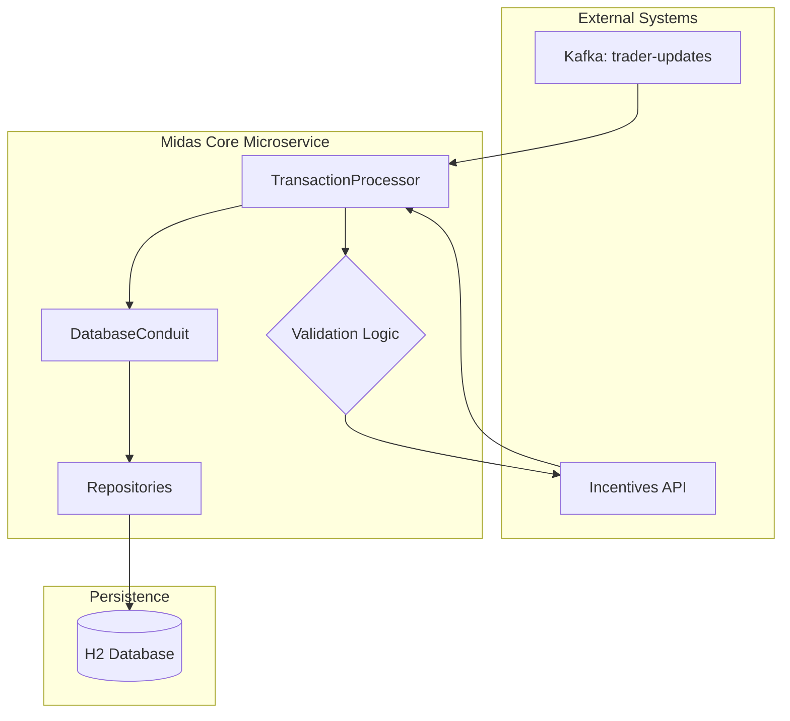

# JPMorgan Chase Transaction Processing System (Simulation)

Built a Spring Boot microservice that processes high-volume financial transactions using Kafka, JPA, and REST APIs.

## 🏗️ Architecture

The system follows a reactive, message-driven architecture to ensure scalability and decoupling:



`Kafka` ➡️ `Consumer (TransactionProcessor)` ➡️ `Service/Logic` ➡️ `Database (H2)` ➡️ `External Incentives API`

1.  **Kafka Ingestion**: High-frequency transaction messages are consumed from a Kafka topic.
2.  **Validation & Processing**: Transactions are validated for sender/recipient existence and sufficient funds.
3.  **Incentive Integration**: Each transaction calls an external REST service to calculate real-time incentives.
4.  **Transaction Finalization**: Updates are persisted atomically, reflecting both the transfer and the reward.

## 🛠️ Tech Stack

- **Framework**: Spring Boot 3.2.5
- **Messaging**: Apache Kafka
- **Data Access**: Spring Data JPA / Hibernate
- **Database**: H2 (In-memory)
- **API Communication**: Spring RestTemplate
- **Java Version**: 17

## 🚀 Features

- ✅ **Kafka-based Transaction Ingestion**: Scalable message consumption for trade updates.
- 💰 **Automated Balance Updates**: Secure and validated fund transfers between users.
- 🎁 **Real-time Incentive Integration**: Dynamic reward calculation via external microservice.
- 📊 **Balance Enquiry**: Integrated REST endpoints for real-time balance checks.

## ⚙️ How It Works

1. Transactions are published to a Kafka topic
2. Spring Boot consumer listens and deserializes messages
3. Transactions are validated and processed
4. User balances are updated in database
5. External Incentive API is called
6. Final state is persisted and exposed via REST API

---

## 🏁 How to Run

### 1. Start the Incentives API
The core transaction processor depends on an external incentives service.
```bash
java -jar services/transaction-incentive-api.jar
```

### 2. Run the Main Application
Run the Spring Boot application using the Maven wrapper:
```bash
./mvnw spring-boot:run
```

### 3. Kafka & Database
- **Kafka Topic**: `trader-updates`
- **H2 Console**: [http://localhost:8080/h2-console](http://localhost:8080/h2-console) (Port: 33400)
